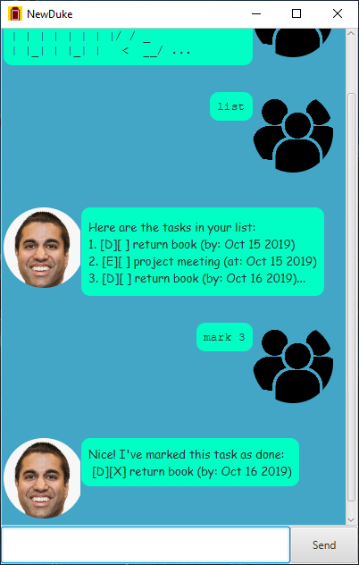
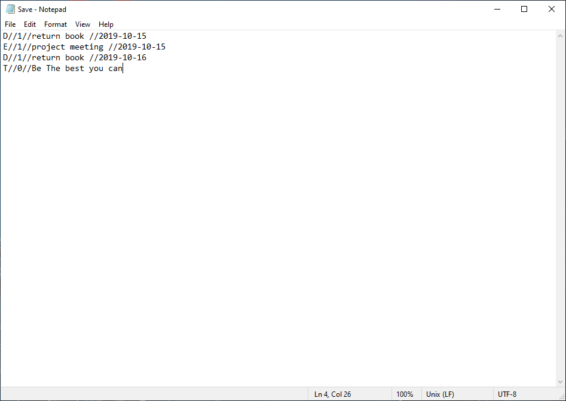

# The new and improved duke

Do you every feel like you have too many things to do but no way to keep track of it? That's where duke comes in! Duke simulates a task manager to keep track of your daily life! 

## List of Features
- Add a task without a date associated (todo)
- Add a task with a date associated (deadline/event)
- Deletes Tasks (by index)
-  Marks and unmarks tasks (by index)
- List all tasks in an easy to read list format 
- Views your schedule on a seperate day

## What do I need to use the project?

Prerequisites: JDK 11 [Download and setup guide here!](https://www.oracle.com/sg/java/technologies/javase/jdk11-archive-downloads.html)

## How do I set up this project? 
There are 3 simple steps! 

1. Download the latest release from [here!](https://github.com/cowlinn/ip/releases) 
2. Extract the file to a working directory of your choice. 
3. Execute the jar format
   1. Ensure you're on the correct working directory 
   2. Entering the command `java -jar duke.jar` in the terminal 
3. If the setup is correct, you should see a something like this :

## Quick Start
1. To view a list of commands, type `help` into the chatbox, a popup should appear with the relevant commands
2. Some example commands you can try:
    * `list`: Returns a list view of all contacts stored
    * `delete 3`: Deletes the 3rd contact shown in the current app
    * `todo wash the dishes`: Adds a todo, with the description to wash the dishes 
    
## Using our commands 
Refer to the handy table below to check our our syntax 

| Command Functionality | Syntax Example | Format Example | Description |
| --- | --- | --- | --- |
| Add todo task | `todo (description)` | todo clean dishes | Adds a todo event to the list |
| Add event task | `event <description> /at <date>`| event submit assignment  /at 2020-05-05 | Adds an event to the list. Notice that these have dates tagged to them, with the syntax: `YYYY-MM-DD`|
| Add Deadline task | `deadline <description> /by <date>` | deadline submit assignment  /at 2020-05-05 | Adds a deadline to the list. Same format as event
| Delete |  `delete <taskListNumber>` |  delete 5 | This deletes the specified task in the list. Note that the tasks go in running order, starting from 1 | 
Find | `find <keyWord(s)>` | find homework | Searches the descriptions of all the tasks in the list, and returns a list view of all the tasks which contain the specified keyword inside. |
| View tasks in List format | `list` | list (no further arguments) | Single word command that returns a list view of the tasks 
| Mark/Unmark tasks | `(un)mark <taskListNumber>` | mark 3 / unmark 4 | Keeps track of whether tasks are done / undone. When loading in a task, it is not done (unmarked by default). Marking adds a cross next to the item in list view, and unmarking does the opposite.
| view schedule on available day | `viewSchedule <date>` | viewSchedule 2022-05-05 | Returns a list view of tasks that happen on that specific day. Do take note of the standard date syntax: `YYYY-MM-DD` |
|View a help sheet| `help`| help | Opens up a document in your browser with all the basic commands |

## Advanced User Saving Guide 
Preview the save file as shown here 

 For our more advanced users, you are able to `edit` the save file using the format specified by our save file. Each argument is deliminated by double backslashes `//`. 
> Here's how to edit the save file yourself. The format for each task is specified by: `taskIndicator//0 or 1//description//date//`.

1. Notice that each line of the text file (located under `SavedData/Save.txt` from your current JAR file directory) corresponds to one task 

- The number `0` & `1` represents under `markindicator` indicates whether the task is marked or not.
- The date follows our standard date syntax: `YYYY-MM-DD`.
- The `description` can be any description of the task 

2. For todo tasks: the format is specified as `T//markIndicator//description`
3. For deadline tasks: The format is specified as `D//markIndicator//description/date//`
4. Similarly, for event tasks: The format is specified as `E//markIndicator//description/date//`
5. Finally, you can simply delete lines to delete the task, and it will be automatically re-ordered for you 

#  Acknowledgements

Credit where it's due to the people who helped along the way! 

## Images 

 - User Icon: @Author: Unknown
    - Retrieved from: "https://www.kindpng.com/imgv/iwoRiix_transparent-clipart-free-download-ajit-pai-hd-png/"

 - User profile: @Author: 

 - App Icon: @Author: UrieW.
    -  Retrieved from OpenGameArt.org @ "https://opengameart.org/content/device-app-icons-with-template"

 ## Code
 1. GUI Inspiration and formatting 
 -  @@author `PinranJ` - reused
    - Reused code from batchmate for GUI styling. Specifically, to shape the user profile into a circle
    - Fit my own ratios into the code
    -  {
        `double circleRadius = displayPicture.getFitWidth() / 2;`
        `double circleX = displayPicture.getX() + circleRadius;`
        `double circleY = displayPicture.getY() + circleRadius;`

        `Circle clip = new Circle(circleX, circleY, circleRadius);`

        `dialog.setText(text);`
        `displayPicture.setImage(img);`
        `displayPicture.setClip(clip);`
        }
        

2. Save System implementation 
- @@ author `Jindra Helcl` - referenced
    - Read solution from stackoverflow to debug fileWriter class not saving properly 
    - Reused from: https://stackoverflow.com/questions/30525437/filewriter-is-not-writing-in-to-a-file

3. Parser switch statements 
 - @@ author `Sergey Kalinichenko` - referenced 
     - Idea to use `toString` method of enums to pass into switch statement for parser
     - Used code block inside my commands 
     - Reused from: https://stackoverflow.com/questions/10387329/using-string-representations-of-enum-values-in-switch-case with heavy modifications 
     - `public enum MyType {`
            `VALUE1 {`
                `public String toString() {`
                    `return "this is my value one";`
                `}`
            `},`

        `VALUE2 {`
                `public String toString() {`
                    `return "this is my value two";`
                `}`
            `}`